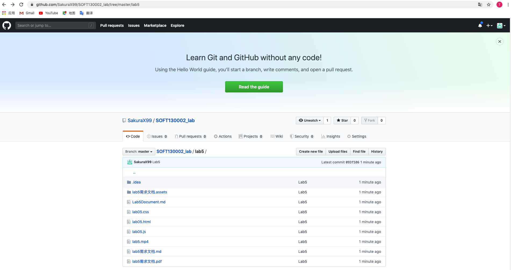
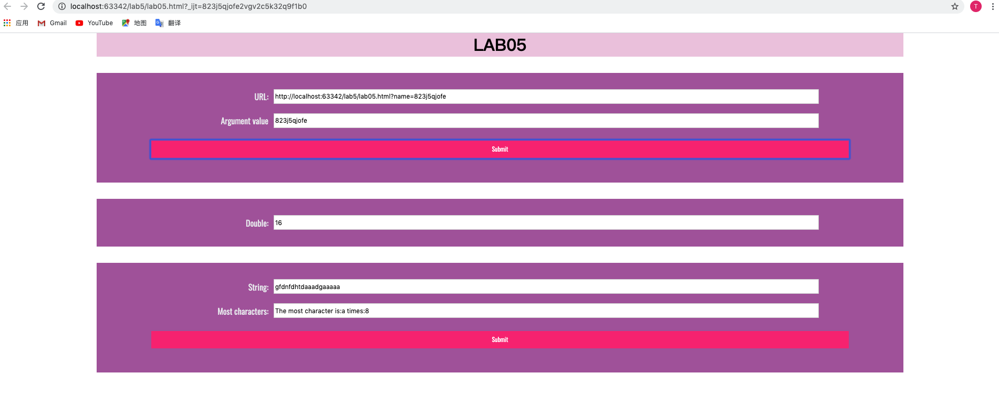

# Lab5 Document
### 函数相关知识点和解决方案
* url解析
    * 寻找param开始的?标识符并使用substring对于url内容进行截取
    * 使用split对于各个参数进行截取
    * 使用sign变量表示是否找到name参数
* 时间计数
    * 记录当前分钟数startTime便于后续控制条件
    * 使用setInterval每五秒运行一次函数
    * 记录当前分钟数和扩增次数判断是否继续扩增
* 最多字符计数
    * 使用object充当map，记录每种字符出现次数，有新字符时新增属性
    * 遍历string获取初心次数数据
    * 遍历obj属性获取max次数的字符和相应次数

### 提交截图和效果图
* 提交截图 

* 效果展示图 
